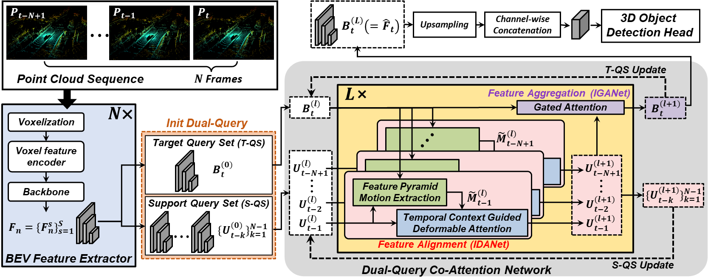

# D-Align
Official repository for **D-Align: Dual Query Co-attention Network for 3D Object Detection Based on Multi-frame Point Cloud Sequence**
[arxiv](https://arxiv.org/abs/2210.00087)

Junhyung Lee, Junho Koh, Youngwoo Lee, Jun Won Choi* (* Corresponding author)

## Abstract

LiDAR sensors are widely used for 3D object detection in various mobile robotics applications. LiDAR sensors continuously generate point cloud data in real-time. Conventional 3D object detectors detect objects using a set of points acquired over a fixed duration. However, recent studies have shown that the performance of object detection can be further enhanced by utilizing spatio-temporal information obtained from point cloud sequences. In this paper, we propose a new 3D object detector, named D-Align, which can effectively produce strong bird's-eye-view (BEV) features by aligning and aggregating the features obtained from a sequence of point sets. The proposed method includes a novel dual-query co-attention network that uses two types of queries, including target query set (T-QS) and support query set (S-QS), to update the features of target and support frames, respectively. D-Align aligns S-QS to T-QS based on the temporal context features extracted from the adjacent feature maps and then aggregates S-QS with T-QS using a gated attention mechanism. The dual queries are updated through multiple attention layers to progressively enhance the target frame features used to produce the detection results. Our experiments on the nuScenes dataset show that the proposed D-Align method greatly improved the performance of a single frame-based baseline method and significantly outperformed the latest 3D object detectors.

  

## Installation
Please refer to [installation.md](docs/installation.md) to install `D-Align`.

## Getting Started
Please refer to [getting_started.md](docs/getting_started.md) to prepare nuScenes dataset.

## Main Result
Results on nuScenes *val* set

|    Model   | Sequence length |  mAP |  NDS | Link |
|:----------:|:---------------:|:----:|:----:|:----:|
| [D-Align_CP](tools/cfgs/D_Align_models/D_Align_CP.yaml) |        3        | 0.6373 | 0.6926 | [model](https://drive.google.com/file/d/1UcTfI3F4FByVJ94xBvs0xyfFP_QaT24J/view?usp=sharing) |

## Acknowledgement
We sincerely thank the authors of [OpenPCDet](https://github.com/open-mmlab/OpenPCDet) and [
Deformable-DETR](https://github.com/fundamentalvision/Deformable-DETR) for their open-source release.
